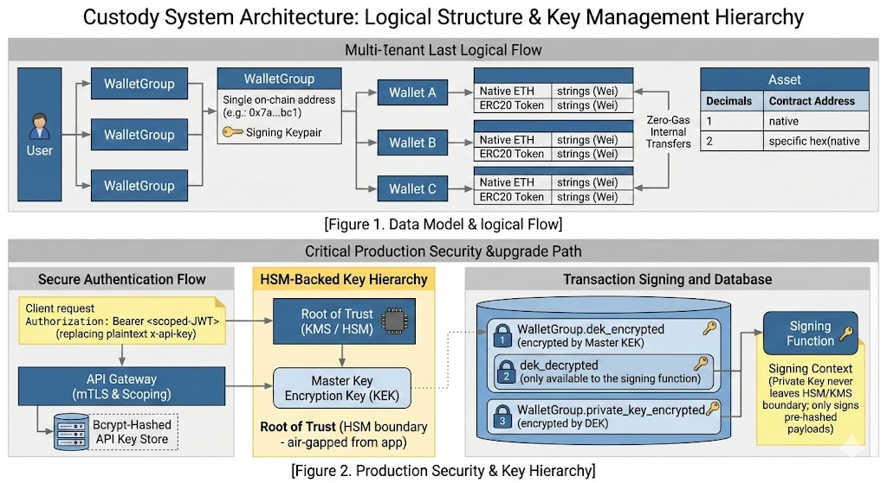

# Custody System: Architecture & Design Notes

*Covers design decisions, key risks, and the path from MVP to production-grade custody.*

**Live deployment:** 
UI: https://vencura-9c82d3427d01.herokuapp.com/
API: https://vencura-9c82d3427d01.herokuapp.com/api

---

## 1. Implementation Overview

I built the core custody model around a **WalletGroup → Wallet** hierarchy. A WalletGroup owns a single secp256k1 keypair and its corresponding on-chain Ethereum address. The private key is AES-256-GCM encrypted with a random IV and stored in the database. Wallets are purely logical sub-accounts within the group. Fund allocation is off-chain bookkeeping with no additional on-chain addresses or contract deployments. This mirrors how institutional custody systems handle sub-accounts: one shared address, internal ledger for allocation. I chose this design because it keeps the on-chain footprint minimal and avoids key management overhead that would multiply with each sub-account.

Internal transfers between wallets in the same group are zero-gas off-chain operations. I write a WITHDRAWAL record on the source wallet and a DEPOSIT record on the destination, giving a complete audit trail without any RPC calls. On-chain sends and contract writes go through the shared WalletGroup EOA via ethers.js v6.

Three background jobs run in `scheduler.ts` on fixed intervals: deposit detection scans new blocks every 60 seconds, transaction reconciliation polls for receipts every 15 seconds, and an on-chain balance sync runs every 10 minutes for single-wallet groups. Multi-wallet groups skip this since their balances are internal allocations. WalletGroup's aggregate balance remains visible on-chain.

### Concurrency Model

To prevent double-spending, I serialize concurrent sends at the database level using PostgreSQL advisory locks (`pg_advisory_xact_lock`) scoped to the wallet group ID. The lock is transaction-scoped, so it releases automatically on commit or rollback. Inside the lock, I decrement both the ETH gas reserve and the ERC20 token amount in `WalletAssetBalance` before broadcast, so any concurrent send sees the reduced balances immediately. The nonce is computed as `max(chainPendingNonce, dbMaxReservedNonce + 1)` within the same lock, making it reasonably safe across multiple processes on a shared PostgreSQL instance.

The main concurrency gap is that the entire send process, which includes gas estimation, on-chain balance check, RPC broadcast, and BROADCASTING status update, all run inside a single `prisma.$transaction` with a 30-second timeout. This means the database connection is held open for 2–5 seconds of network I/O per send. Under load, concurrent sends drain the connection pool and starve other queries. More critically, if the transaction times out after the signed transaction has already entered the mempool, the DB rolls back (balance restored, PENDING record deleted) while the on-chain transaction propagates. This leaves a broadcast transaction with no database record. The reconciliation cron job cannot recover it because there is no row to reconcile. I discuss how I would address this in the production section.

### System Architecture

---

## 2. Security & Risk

### Key Management (Critical)

> **⛔ Critical:** The entire system's security rests on a single `ENCRYPTION_KEY` environment variable. Every private key in the database is encrypted with this one key, and both the encryption key and all ciphertexts live in the same trust boundary.

Any application-level compromise, such as remote code execution, a misconfigured log drain that prints environment variables, or a memory dump, yields every unencrypted private key simultaneously. There is no per-wallet isolation. Beyond the configuration variable, the private key is also briefly present in the Node.js process heap while being decrypted for signing. A memory inspection at the wrong moment would expose it. While the AES-256-GCM primitive works for demo purposes, the weakness is entirely in where the encryption key lives and how signing is performed.

The production fix is a proper key hierarchy: a root of trust in an HSM (or MPC network) at the top, a Master Key Encryption Key managed by that root, per-wallet Data Encryption Keys encrypted by the MEK and stored in the DB, and private keys encrypted by their DEK. Signing should happen inside the HSM or MPC system so the plaintext key never exists in process memory at all. I architected `keyvault.ts` as an abstraction. Callers never interact with keys directly, so swapping the implementation from the configuration variable AES to HSM or MPC requires no changes to the rest of the codebase.

A particularly compelling alternative to hardware HSMs (or cold storage) for this scale is **Multi-Party Computation (MPC)** threshold ECDSA. Rather than encrypting and storing a private key at all, the key is to mathematically split into shares held by independent parties (e.g., 2-of-3). No single party ever reconstructs the full key; signing is a collaborative protocol. This eliminates the single-point-of-compromise entirely. Open-source implementations like tss-lib and dkls23 make it self-hostable. The `keyvault.ts` abstraction is again the right insertion point.

### Blockchain-Specific Risks

#### Broadcast Race — No Record of a Sent Transaction

> **⚠️ High:** As described in the concurrency section, a DB transaction timeout after a successful broadcast produces a transaction on-chain with no corresponding database record. The balance appears restored but funds have moved.

This is a classic custody race condition. The fix is a two-phase commit: commit the balance deduction and PENDING record first, then broadcast outside any DB transaction, then update to BROADCASTING. This way, a post-broadcast timeout leaves a stale PENDING record (no txHash) that the reconciler can retry or expire. It will never deal with a ghost transaction.

#### Deposit Detection Without Confirmation Depth

> **⚠️ High:** The deposit detector credits balances immediately on the first block where a transaction appears. On any chain with meaningful reorg probability, this is a double-credit risk.

A chain reorganization can evict a transaction from the canonical chain after I have already credited it. I currently have no protection against this. The `UNIQUE(walletId, txHash, assetType)` constraint prevents duplicate credits for the same hash, but if that hash gets reorganized away and a different hash takes its place, the original credit stays. Production systems require waiting for a confirmation depth before crediting deposits. For instance, waiting for 6–12 block confirmations significantly reduces the probability that the transaction is removed by a chain reorganization. We need to factor in finality before crediting a transaction.

#### No Mechanism for Stuck Transactions

> **⚠️ High:** If a broadcast transaction gets stuck in the mempool, because network gas prices spiked above the estimate I used at send time, the reconciler polls indefinitely for a receipt that never arrives.

There is no automatic Replace-By-Fee (RBF) bump or expiry logic. A stuck BROADCASTING transaction holds the locked balance indefinitely and the wallet cannot send again from that nonce slot. Production requires a timeout policy: after N minutes without a receipt, attempt an RBF bump with a higher gas price, or cancel by sending a zero-value transaction to self at the same nonce.

#### Background Job Reliability

> **⚠️ High:** All three cron jobs run as `setInterval` callbacks in the main process. There is no retry logic, no dead-letter queue, and no persistence of job state across restarts.

If the server crashes mid-reconciliation, the in-memory `isReconcilingBroadcasts` guard resets on resta. This is fine, but any partially-processed batch is simply abandoned. More seriously, if the server is down for an extended period, the deposit detector resumes from `lastSyncBlock` and catches up, but there is no alerting on a large gap, and if the RPC node has pruned old blocks, the scan silently skips them. The reconciler also has no awareness of its own operational status. A silent failure in the interval callback (e.g., a DB connectivity error) will simply not run until the next tick, with no alerting.

#### Single RPC Endpoint Dependency

All blockchain reads and writes go through a single Sepolia RPC URL. If that endpoint goes down or rate-limits the application, deposit detection stops, sends fail, and the reconciler stalls. This is an availability risk that grows proportionally with the value held in custody. We should use other RPCs, such as Alchemy, as fallbacks in production.

### Non-Custodial Wallet Security

#### Challenge Format and Cross-Domain Replay

> **🟡 Medium:** The SIWE challenge is a plain string built around a `randomBytes(16).toString('hex')` nonce. It does not include domain, chainId, or URI. These fields make EIP-4361 structured messages resistant to cross-domain replay.

A user can be social-engineered into signing the same message on a malicious site, which then replays the signed challenge against this service to authenticate as that user. The challenge is address-bound and has a 5-minute TTL, which limits the window, but the structural replay vector remains. Adopting EIP-4361 (which embeds the exact service domain, chain, and URI into the signed message) closes this entirely.

#### Unbounded In-Memory Session State

> **🟡 Medium:** Challenge and session state live in two `Map` objects in `connectedWalletService.ts` with no global size limit.

Under a challenge-flood attack, which involves many `POST /challenge` calls with distinct addresses that never complete verification, the challenge map grows without bound. This consumes memory until the process runs out. Sessions are also lost on every restart and are incompatible with multiple API instances. Production moves both maps to Redis with max-key limits, TTL-based eviction, and atomic operations for the challenge-claim race.

### Intentionally Simplified for the Demo

> **ℹ️ Note:** The following are known gaps that do not affect the core custody mechanics being demonstrated. Nevertheless, they all must be addressed before handling real user funds.

#### API Key Authentication

> **🟡 Medium:** Every request is authenticated with a plaintext static API key stored in the database with no expiry, scoping, rate limiting, or rotation mechanism.

A leaked key grants permanent full access to all wallet operations for that user. There is no way to scope it to read-only or limit it by IP. There is no key rotation workflow, so a compromised credential requires a manual database update. Additionally, `GET /api/users/me` returns the `apiKey` field in the response body, which re-exposes the credential over the wire on every profile fetch. A production deployment would replace this with short-lived OAuth 2.0 JWTs carrying scoped permissions, combined with mTLS at the API gateway layer. I chose to leave this simplified for the demo — it does not affect the custody mechanics I was demonstrating, but it is not acceptable for a system holding real funds.

#### CORS Policy

> **🟡 Medium:** The API uses `app.use(cors())` with no options, which sets `Access-Control-Allow-Origin: *` — any web origin can make credentialed requests to the API.

The API uses `app.use(cors())` with no options, which allows any web origin to issue cross-origin requests to the API from a browser and read the responses. This broadens the attack surface and makes it easier for malicious sites to interact with the API from a victim's browser. The production fix is to explicitly allow trusted frotend origins (`https://vencura-9c82d3427d01.herokuapp.com`) and restrict allowed methods and headers. CORS should also enforce credentials and require explicit origin matching.

#### Other Simplified Items

Error messages from `routeHandler.ts` pass `err.message` directly to the client, which can surface Prisma error detail including table and field names. Production would return opaque error codes and log the full error server-side only.

---

## 3. Non-Custodial Wallets

The non-custodial flow allows users to connect an existing Metamask Ethereum wallet without the server ever touching their private key. Authentication follows a Sign-In With Ethereum (SIWE) pattern: the client requests a challenge for their address, signs it locally using their wallet, and sends the signature back for verification. The server uses `ethers.verifyMessage` to recover the signing address from the signature and checks that it matches the claimed address. On success, it issues an HMAC-SHA256 session token with a 15-minute idle timeout.

**What I implemented correctly:** The challenge is address-bound. It embeds the claimed address in the message via `buildChallengeMessage(normalizedAddress, nonce)` and is stored keyed by address, so a challenge issued for one address cannot be used to authenticate as another. Token comparison uses `timingSafeEqual` to prevent timing attacks. Challenges expire after 5 minutes.

**What needs to change for production:** The challenge message format should be upgraded to EIP-4361 (structured fields including domain, chainId, URI, and nonce) to prevent cross-domain replay attacks. Session state should move from in-memory Maps to Redis to survive restarts and support horizontal scaling. Max-entry limits should be added to the challenge map to prevent memory exhaustion under a challenge-flood attack.

---

## 4. Testing

| Tier | Files | What Is Verified |
|---|---|---|
| Unit / route (fully mocked) | `*.route.test.ts`, `*.security.test.ts`, `*.validation.test.ts` | HTTP status codes, request validation, auth enforcement, key material never leaked in responses |
| Integration (real DB, mocked RPC) | `*.integration.test.ts` | Full send/receive lifecycle, deposit detection, ERC20 transfers, contract read/write, non-custodial challenge/verify/logout |
| Concurrency | `concurrency.test.ts` | Double-spend prevention, deposit deduplication, reconciler conflict avoidance, `lockedAmount` restoration |
| Security | `*.security.test.ts` | Encrypted key never returned in responses, private key / mnemonic / seed rejected in request bodies |

All RPC calls are mocked via `jest.spyOn` on the provider — no local Ethereum node is required to run the test suite. Gaps: no end-to-end tests against a live chain, no reorg simulation, no load testing, no adversarial fuzzing of inputs or block data.

---

## 5. Path to Production

### Concurrency & Background Job Architecture

The send transaction must be split into two separate database transactions. Today, the advisory lock, balance deduction, nonce reservation, RPC broadcast, and BROADCASTING status update all happen inside a single `prisma.$transaction`. In production, I would commit the balance deduction and PENDING record in a short first transaction, perform the RPC broadcast outside any transaction, and then update to BROADCASTING in a second transaction. This eliminates the rollback-after-broadcast race and dramatically reduces the time the DB connection is held per send.

The `setInterval` cron jobs in `scheduler.ts` need to be replaced with a proper job queue, most naturally **BullMQ backed by Redis**. BullMQ gives built-in retry with exponential backoff, dead-letter queues for jobs that exhaust retries, concurrency controls, and job state persistence across restarts. A crashed server no longer silently drops an in-flight reconciliation tick — the job stays in the queue. Deposit detection can also move from 60-second block polling to RPC WebSocket event subscriptions, making deposit crediting near-real-time rather than up-to-60-seconds delayed.

The nonce manager is safe across multiple API instances as long as nonce allocation goes through a single Postgres primary and uses a transaction-scoped advisory lock keyed by chainId and wallet address. Inside that lock, computing `max(chainPendingNonce, dbMaxReservedNonce + 1)` and persisting the reserved nonce in the same transaction prevents concurrent allocation. If we move to multiple databases, we would need a distributed coordinator to handle nonce synchroniztion.

### P0 — Before Any Real Funds

**Key hierarchy and MPC/HSM migration.** I would replace the `ENCRYPTION_KEY` configuration variable with a proper key hierarchy rooted in an HSM or MPC system. If choosing MPC, the private key would never be stored or reconstructed at all. The shares would be distributed across independent co-signers, with signing triggered by a threshold approval protocol inside `keyvault.ts`.

**Audit log.** An append-only `AuditLog` table is required before any real user touches the system — every send, transfer, and key operation needs a record of who authorized it, from which IP, and what the balance state was before and after. Without this, there is no forensic capability and no path to SOC 2 or regulatory compliance.

**Transaction policy engine.** I need to add per-wallet velocity limits, destination address allowlists, and M-of-N approval gates before allowing external users to send. Right now, any authenticated credential can send any amount to any address with no additional checks. That is appropriate for a demo but not for a custody product.

**AML / OFAC screening.** Every destination address needs to be checked against sanctions lists (e.g., via Chainalysis or TRM Labs) before a transaction is signed and broadcast. Skipping this creates regulatory liability in essentially every jurisdiction where digital asset custody is a regulated activity.

### P1 — Before First External Users

**Two-phase broadcast.** As described in the concurrency section, I need to separate the balance commit from the RPC broadcast so that a timeout after broadcast doesn't produce a ghost transaction. The reconciler already has the logic to handle stale PENDING records. I just need the broadcast to happen outside the DB transaction.

**Deposit confirmation depth.** I need to add a minimum confirmation threshold (6–12 blocks) before crediting any deposit. A reorg that evicts a deposit transaction would currently result in a credited balance that no longer exists on-chain, which is unrecoverable without manual intervention.

**Stuck transaction handling.** I need a TTL policy for BROADCASTING transactions: after a configurable window without a receipt, automatically attempt an RBF fee bump or cancel via a self-send at the same nonce. Without this, manual intervention will be needed to unlock a wallet's nonce and balance.

**Multi-RPC fallback.** The deposit detector, reconciler, and send flow all go through a single RPC endpoint. I would configure at least two failover providers (e.g., Alchemy → Infura → self-hosted node) so that an endpoint outage doesn't halt custody operations entirely.

**Redis session store + EIP-4361 for non-custodial wallets.** The in-memory Maps need to move to Redis before the service runs more than one instance, and the challenge message format needs to be upgraded to EIP-4361 to prevent cross-domain replay.

### P2 — Production Scale

**Job queue (BullMQ + Redis).** Replace all three `setInterval` crons with BullMQ workers so that retries, dead-letter queues, and crash recovery are handled by the infrastructure rather than the application code. This also makes it straightforward to add operational visibility including job dashboards, latency metrics, and failure rate alerting.

**Event-driven deposit detection.** Switch from polling `eth_blockNumber` every 60 seconds to subscribing to new block events over a WebSocket RPC connection. This reduces deposit crediting latency to near-real-time and removes the polling overhead from the RPC quota.

**Redis nonce manager.** Replace the current `max(chain, db)` nonce logic with a Redis-backed atomic counter per wallet group address. This makes the nonce manager safe across multiple API instances without relying on the PostgreSQL advisory lock for cross-process coordination.

**Structured error handling and observability.** Replace the raw `err.message` passthrough in `routeHandler.ts` with opaque error codes and correlation IDs. Add structured JSON logging with the correlation ID on every request, and feed logs to a SIEM for alerting on anomalous send patterns or repeated errors.

### P3 — Longer Term

**XMTP wallet-to-wallet messaging.** I would integrate XMTP to power the approval workflow. When a send exceeds a policy threshold, the system messages required approvers at their Ethereum addresses, and their signed approvals are collected server-side before broadcast. This is deferred because it requires both parties to be XMTP-registered and needs a persistent streaming listener, and it is only useful once the policy engine is in place.

**ERC-4337 Smart Wallets.** Replacing the current EOA-per-WalletGroup model with ERC-4337 contract accounts would enable on-chain M-of-N enforcement, gas sponsorship via Paymaster, and scoped session keys. This is deferred because it requires per-WalletGroup factory contract deployments, a Bundler service, and a fundamentally different transaction construction path. This adds significant scope, but doesn't add to the core custody mechanics the MVP demonstrates.

---

## Appendix A — Database Schema

| Model | Key Fields | Notes |
|---|---|---|
| **User** | `id`, `email @unique`, `apiKey @unique` | Plaintext API key — intentionally simplified for demo |
| **WalletGroup** | `id`, `address @unique`, `encryptedKey`, `lastSyncBlock`, `ownerId` | The custody unit; holds the keypair. `@@unique([ownerId, nameNormalized])` |
| **Wallet** | `id`, `walletGroupId`, `ownerId?` | Logical sub-account within a group. `@@unique([walletGroupId, nameNormalized])` |
| **WalletAccess** | `walletId`, `userId` | Wallet sharing grant. `@@unique([walletId, userId])` |
| **Transaction** | `walletId`, `type TxType`, `assetType`, `amount`, `txHash?`, `nonce?`, `gasPrice?`, `lockedAmount`, `status TxStatus` | `@@unique([walletId, txHash, assetType])` — idempotent deposits. Amounts as Wei strings. `lockedAmount`: native = amount+gasCost, ERC20 = gasCost only (token tracked in WalletAssetBalance). Internal transfers write WITHDRAWAL + DEPOSIT pair; INTERNAL enum unused. |
| **Asset** | `type AssetType`, `symbol`, `decimals`, `contractAddress @unique` | Sentinel `"native"` for ETH avoids nullable unique constraint issue |
| **WalletAssetBalance** | `walletId`, `assetId`, `balance` | `@@unique([walletId, assetId])`. Wei string. Decremented within advisory lock at send time; restored by reconciler on on-chain failure. |

| Enum | Values |
|---|---|
| TxType | `DEPOSIT`, `WITHDRAWAL`, `CONTRACT`, `INTERNAL` |
| TxStatus | `PENDING` → `BROADCASTING` → `CONFIRMED` / `FAILED` |
| AssetType | `NATIVE`, `ERC20` |

---

## Appendix B — API Endpoints

| Method | Path | Auth | Description |
|---|---|---|---|
| **Users** ||||
| POST | `/api/users` | None | Create user. Returns `{ id, email, apiKey }` |
| GET | `/api/users/me` | API key | Get current user (returns `apiKey` in response) |
| **Wallet Groups** ||||
| POST | `/api/wallet-groups` | API key | Create wallet group (generates keypair + on-chain address) |
| GET | `/api/wallet-groups` | API key | List owned wallet groups |
| GET | `/api/wallet-groups/:id` | API key | Get wallet group |
| PATCH | `/api/wallet-groups/:id` | API key | Rename wallet group |
| DELETE | `/api/wallet-groups/:id` | API key | Delete wallet group (cascades to wallets and transactions) |
| POST | `/api/wallet-groups/:id/wallets` | API key | Create wallet within an existing group |
| **Wallets** ||||
| POST | `/api/wallets` | API key | Create wallet (auto-creates a WalletGroup) |
| GET | `/api/wallets` | API key | List wallets the user owns or has access to |
| GET | `/api/wallets/:id` | API key | Get wallet |
| PATCH | `/api/wallets/:id` | API key | Rename wallet |
| POST | `/api/wallets/:id/share` | API key | Grant another user access to this wallet |
| POST | `/api/wallets/:id/send` | API key | Send ETH or ERC20 on-chain. Body: `{ to, amount, assetId? }` |
| POST | `/api/wallets/:id/transfer` | API key | Internal off-chain transfer. Body: `{ toWalletId, amount }` |
| POST | `/api/wallets/:id/sign` | API key | Sign a message (EIP-191). Returns `{ signature, address }` |
| GET | `/api/wallets/:id/transactions` | API key | List transactions for wallet |
| **Balance & Assets** ||||
| GET | `/api/balance/:walletId` | API key | Returns `{ balance, lockedBalance, formatted }` (Wei strings) |
| GET | `/api/assets` | API key | List registered ERC20 assets |
| **Contracts** ||||
| POST | `/api/contracts/read` | API key | Call a read-only contract function |
| POST | `/api/contracts/write` | API key | Send a state-changing contract transaction |
| **Non-Custodial Wallet** ||||
| POST | `/api/connected-wallet/challenge` | None | Issue SIWE challenge. Body: `{ address }`. Returns `{ message }` |
| POST | `/api/connected-wallet/verify` | None | Verify signature. Body: `{ address, signature }`. Returns `{ token }` |
| POST | `/api/connected-wallet/logout` | Bearer token | Invalidate session |
| GET | `/api/connected-wallet/wallets` | Bearer token | List wallets accessible to the connected address |

---